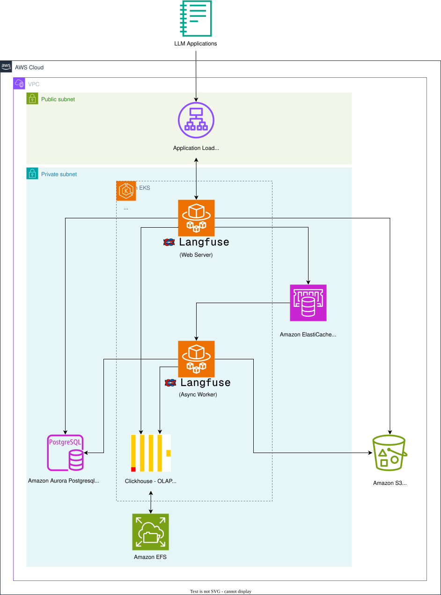

# AWS Langfuse Terraform module

This repository contains a Terraform module for deploying [Langfuse](https://langfuse.com/) - the open-source LLM observability platform - on AWS.
This module aims to provide a production-ready, secure, and scalable deployment using managed services whenever possible.

## Usage

1. Set up the module with the settings that suit your need. A minimal installation requires a `domain` which is under your control. Configure the kubernetes and helm providers to connect to the EKS cluster.

```hcl
module "langfuse" {
  source = "github.com/langfuse/langfuse-terraform-aws?ref=1.1.1"

  domain = "langfuse.example.com"

  # Optional use a different name for your installation
  # e.g. when using the module multiple times on the same AWS account
  name   = "langfuse"

  # Optional: Configure Langfuse
  # use_encryption_key = false # Disable encryption (default is true for security)

  # Optional: Configure the VPC
  vpc_cidr = "10.0.0.0/16"
  use_single_nat_gateway = false  # Using a single NAT gateway decreases costs, but is less resilient

  # Optional: Configure the Kubernetes cluster
  kubernetes_version = "1.36"
  fargate_profile_namespaces = ["kube-system", "langfuse", "default", "cert-manager", "clickhouse-operator-system"]

  # Optional: Configure the database instances
  postgres_instance_count = 2
  postgres_min_capacity = 0.5
  postgres_max_capacity = 2.0

  # Optional: Configure the cache
  cache_node_type = "cache.t4g.small"
  cache_instance_count = 2

  # Optional: Configure Langfuse Helm chart version
  langfuse_helm_chart_version = "2.0.2"

  # Optional: Pin the Langfuse application version. Defaults to the latest
  # release at the time this module version was published.
  app_version = "4.25.0"
  
  # Optional: Activate additional log tables in ClickHouse. Will increase EFS costs, but may aid in debugging.
  enable_clickhouse_log_tables = false  # Set to true to have additional logs.

  # Optional: Enable tenant- and network-isolated code evaluator execution.
  enable_code_based_eval_executors = true

  # Optional: Langfuse AI features (in-app agent, Ask AI). Requires >= 4.24.
  ai_features_provider = "bedrock"
  ai_features_model    = "eu.anthropic.claude-opus-5"
  enable_in_app_agent  = true

  # Optional: Add additional environment variables
  additional_env = [
    # Direct value
    {
      name  = "CUSTOM_ENV_VAR"
      value = "custom-value"
    },
    # Reference to Kubernetes secret
    {
      name = "DATABASE_PASSWORD"
      valueFrom = {
        secretKeyRef = {
          name = "my-database-secret"
          key  = "password"
        }
      }
    }
  ]
}

provider "kubernetes" {
  host                   = module.langfuse.cluster_host
  cluster_ca_certificate = module.langfuse.cluster_ca_certificate
  token                  = module.langfuse.cluster_token

  exec {
    api_version = "client.authentication.k8s.io/v1beta1"
    command     = "aws"
    args        = ["eks", "get-token", "--cluster-name", module.langfuse.cluster_name]
  }
}

provider "helm" {
  kubernetes {
    host                   = module.langfuse.cluster_host
    cluster_ca_certificate = module.langfuse.cluster_ca_certificate
    token                  = module.langfuse.cluster_token

    exec {
      api_version = "client.authentication.k8s.io/v1beta1"
      command     = "aws"
      args        = ["eks", "get-token", "--cluster-name", module.langfuse.cluster_name]
    }
  }
}
```

You can also navigate into the `examples/quickstart` directory and run the example there.

2. Apply the DNS zone

```bash
terraform init
terraform apply --target module.langfuse.aws_route53_zone.zone
```

3. Set up the Nameserver delegation on your DNS provider, e.g.

```bash
$ dig NS langfuse.example.com
ns-1.awsdns-00.org.
ns-2.awsdns-01.net.
ns-3.awsdns-02.com.
ns-4.awsdns-03.co.uk.
```

4. Apply the full stack. If this fails, run through the commands under Known Issues, and then re-run the apply command.

```bash
terraform apply
```

### Known issues

Two race conditions can leave pods stuck in `Pending` on the initial system creation:

1. **CoreDNS**: due to a race between the Fargate Profile creation and Kubernetes pod scheduling, the CoreDNS pods may need to be restarted.
2. **ClickHouse and Keeper**: the Fargate scheduler evaluates a pod's volumes at admission time. On the first install, the PVCs created by the ClickHouse operator may not yet be bound to the pre-created EFS volumes when the scheduler first looks, and the pods are rejected with an event like:

   ```
   Warning  FailedScheduling  fargate-scheduler  Pod not supported on Fargate: volumes not supported:
   clickhouse-storage-volume not supported because: PVC clickhouse-storage-volume-langfuse-clickhouse-0-0-0 not bound
   ```

   The PVCs bind on their own moments later (`kubectl --namespace langfuse get pvc` shows them as `Bound`), but the Fargate scheduler does not reliably re-evaluate rejected pods. Deleting the pending pods makes the StatefulSet recreate them, and the fresh scheduling attempt succeeds.

```bash
# Connect your kubectl to the EKS cluster
aws eks update-kubeconfig --name langfuse

# Restart the CoreDNS and ClickHouse containers
kubectl --namespace kube-system rollout restart deploy coredns
kubectl --namespace langfuse delete pod langfuse-clickhouse-0-{0,1,2}-0 langfuse-keeper-{0,1,2}-0
```

Both issues only occur on the first install, not in steady state. Afterward, your installation should become fully available.
Navigate to your domain, e.g. langfuse.example.com, to access the Langfuse UI.

### Using an Existing VPC

If you already have a VPC and want to deploy Langfuse into it, you can provide the VPC ID and subnet IDs instead of having the module create a new VPC:

```hcl
module "langfuse" {
  source = "github.com/langfuse/langfuse-terraform-aws?ref=1.1.1"

  domain = "langfuse.example.com"

  # Use existing VPC
  vpc_id             = "vpc-12345678"
  private_subnet_ids = ["subnet-aaa11111", "subnet-bbb22222", "subnet-ccc33333"]
  public_subnet_ids  = ["subnet-xxx11111", "subnet-yyy22222", "subnet-zzz33333"]

  # Optional: Provide route table IDs for S3 VPC Gateway endpoint
  # If not provided, S3 endpoint will not be created
  private_route_table_ids = ["rtb-11111111", "rtb-22222222"]
}

provider "kubernetes" {
  host                   = module.langfuse.cluster_host
  cluster_ca_certificate = module.langfuse.cluster_ca_certificate
  token                  = module.langfuse.cluster_token

  exec {
    api_version = "client.authentication.k8s.io/v1beta1"
    command     = "aws"
    args        = ["eks", "get-token", "--cluster-name", module.langfuse.cluster_name]
  }
}

provider "helm" {
  kubernetes {
    host                   = module.langfuse.cluster_host
    cluster_ca_certificate = module.langfuse.cluster_ca_certificate
    token                  = module.langfuse.cluster_token

    exec {
      api_version = "client.authentication.k8s.io/v1beta1"
      command     = "aws"
      args        = ["eks", "get-token", "--cluster-name", module.langfuse.cluster_name]
    }
  }
}
```

**Important Notes:**
- The module will automatically tag your subnets with the required Kubernetes tags for the AWS Load Balancer Controller:
  - Private subnets: `kubernetes.io/role/internal-elb=1` and `kubernetes.io/cluster/<name>=shared`
  - Public subnets: `kubernetes.io/role/elb=1` and `kubernetes.io/cluster/<name>=shared`
- Private subnet IDs and public subnet IDs are required when using an existing VPC
- Private route table IDs are optional - provide them if you want the module to create an S3 VPC Gateway endpoint
- Your existing VPC must have DNS hostnames and DNS support enabled
- Subnets should be spread across multiple availability zones for high availability

## Architecture



> :information_source: For more information on Langfuse's architecture, please check [the official documentation](https://langfuse.com/self-hosting#architecture)

## Resource Configuration

This module provides configurable resource allocation for all container workloads to ensure optimal performance in production environments. On AWS EKS Fargate, resource requests and limits are set to the same value for each container.
The default values are based on the recommendations from the [Langfuse K8s documentation](https://github.com/langfuse/langfuse-k8s) and [Bitnami ClickHouse chart documentation](https://github.com/bitnami/charts/tree/main/bitnami/clickhouse).

### Default Resource Allocations

- **Langfuse containers** (web and worker): 2 CPU, 4 GiB memory
- **ClickHouse containers**: 2 CPU, 8 GiB memory
- **ClickHouse Keeper containers**: 1 CPU, 2 GiB memory

These defaults provide a good starting point for production workloads, but you can adjust them based on your specific requirements by setting the corresponding variables in your Terraform configuration.

### Code-Based Evals

Set `enable_code_based_eval_executors = true` to enable Python and TypeScript code evaluators. The module creates tenant-isolated Lambda functions, an isolated VPC with DNS resolution disabled and no internet route or security-group egress, versioned S3 deployment packages, CloudWatch logs, and the least-privilege IAM permissions required for Langfuse to invoke the functions. It also configures the Langfuse web and worker deployments to dispatch and process code eval jobs.

The Lambda handlers are copied from the canonical [Langfuse code eval runners](https://github.com/langfuse/langfuse/tree/main/scripts/code-eval-runners). They run in an isolated VPC, separate from the Langfuse VPC, so evaluator code cannot access Langfuse databases, caches, pods, or the public internet. That VPC is shared with the [AI features](#ai-features) agent sandbox — the other workload that runs untrusted code — and each workload gets its own deny-all security group. Size it with `isolated_execution_vpc_cidr`.

AWS Lambda tenant isolation is available in commercial AWS regions except Asia Pacific (New Zealand). It is not available in AWS GovCloud or China regions. When code-based evals are enabled, `name` must be at most 32 characters to fit Lambda and IAM naming limits.

### AI features [#ai-features]

Langfuse's AI features — the in-app agent and Ask AI in the filter search bar — need one
instance-wide Langfuse AI model. Requires Langfuse `>= 4.24` and is off by default. See the
[AI features](https://langfuse.com/security/ai-features) and
[self-hosting](https://langfuse.com/self-hosting/configuration/langfuse-assistant) docs.

```hcl
module "langfuse" {
  # ...
  app_version = "4.25.0" # or newer

  ai_features_provider = "bedrock"
  ai_features_model    = "eu.anthropic.claude-opus-5"
  enable_in_app_agent  = true

  # Optional: isolated file and code execution for the agent
  enable_agent_sandbox_microvm = true
}
```

Setting `ai_features_provider` and `ai_features_model` renders `LANGFUSE_AI_*` on web and
worker; both call the model, web for Ask AI and conversation titles and worker for agent runs.
For `bedrock` the module also grants `bedrock:InvokeModel` and
`bedrock:InvokeModelWithResponseStream` on the Langfuse IAM role — invoke-only, and on every
model by default, which is cost exposure rather than privilege. Narrow it with
`ai_features_bedrock_model_arns`. Activate the model in the Bedrock model catalog first: the
first invocation of a third-party model starts an AWS Marketplace subscription, and Anthropic
models also require a first-time-use form.

`anthropic` and `openai` need no AWS resources; pass `LANGFUSE_AI_API_KEY` through
`additional_env` with a `valueFrom.secretKeyRef`.

This module writes the AI feature variables itself, so do not also set the Helm chart's own
AI feature values. Both would render into the same containers, leaving two entries per
variable; the module's value wins, but only because `additionalEnv` is rendered last.

#### Agent sandbox (Lambda MicroVM)

`enable_agent_sandbox_microvm = true` backs the agent's file and code execution tools with an
AWS Lambda MicroVM. The module creates an S3 bucket for the image artifact, a build role that
Lambda assumes during `CreateMicrovmImage`, an unprivileged execution role the guest runs as,
a deny-all security group and VPC egress network connector in the shared
[isolated VPC](#code-based-evals), the `RunMicrovm` permissions on the Langfuse IAM role, and
the `LANGFUSE_IN_APP_AGENT_SANDBOX_*` variables on the worker.

Without the egress connector AWS attaches its default `INTERNET_EGRESS` connector and
sandboxed code reaches the public internet, so the connector is not optional. Lambda MicroVMs
are available only in commercial AWS regions, not GovCloud or China, and the region must offer
them; apply fails otherwise.

The module does **not** build the MicroVM image — that needs a Langfuse checkout, Docker and
pnpm. After apply, from a [Langfuse](https://github.com/langfuse/langfuse) checkout at the
same version you deploy:

```bash
export AWS_PROFILE=<profile>
terraform output -json agent_sandbox_build_env \
  | jq -r 'to_entries[] | "export \(.key)=\(.value)"' > .env && source .env

bash packages/in-app-agent-sandbox-runtime/build-microvm-image.sh
```

The identity running the script needs `s3:PutObject` on the artifact bucket,
`lambda:CreateMicrovmImage` / `ListMicrovmImages` / `GetMicrovmImage` / `UpdateMicrovmImage`,
and `iam:PassRole` on the build role. Without that `iam:PassRole`, `CreateMicrovmImage`
returns `AccessDeniedException`.

Rebuild the image whenever you upgrade Langfuse, and build it from the same release you
deploy. Treat the image as part of the deployment rather than one-time setup: the worker does
not currently verify that the guest runtime matches its own version, so an image left behind
by an upgrade surfaces as file or bash tools misbehaving rather than as a clear error.

### Customizing Resources

You can override any of the resource configurations by setting the appropriate variables.
For example, to increase ClickHouse Keeper resources:

```hcl
module "langfuse" {
  source = "github.com/langfuse/langfuse-terraform-aws?ref=1.1.1"

  domain = "langfuse.example.com"

  # Increase ClickHouse Keeper resources
  clickhouse_keeper_cpu    = "2"
  clickhouse_keeper_memory = "4Gi"
}
```

## Features

This module creates a complete Langfuse stack with the following components:

- VPC with public and private subnets (or use an existing VPC)
- EKS cluster with Fargate compute
- Aurora PostgreSQL Serverless v2 cluster
- ElastiCache Redis cluster
- S3 bucket for storage
- ClickHouse cluster managed by the official [ClickHouse Kubernetes operator](https://github.com/ClickHouse/clickhouse-operator) (including ClickHouse Keeper and cert-manager), or optionally an external ClickHouse such as ClickHouse Cloud
- TLS certificates and Route53 DNS configuration
- Required IAM roles and security groups
- Optional tenant-isolated AWS Lambda executors for code-based evals
- Optional AWS Lambda MicroVM sandbox for the in-app agent's code execution tools
- AWS Load Balancer Controller for ingress
- EFS CSI Driver for persistent storage

## Langfuse version

The module deploys the Langfuse Helm chart v2 (`langfuse_helm_chart_version`), which ships [Langfuse v4](https://langfuse.com/docs/v4). The Langfuse application version is pinned explicitly through the `app_version` variable, which defaults to the latest Langfuse release at the time the module version was published. To upgrade Langfuse, set `app_version` to a newer [release](https://github.com/langfuse/langfuse/releases):

```hcl
module "langfuse" {
  # ...
  app_version = "4.25.0"
}
```

## ClickHouse

By default the Langfuse Helm chart v2 deploys a ClickHouse cluster into the EKS cluster through the official [ClickHouse Kubernetes operator](https://github.com/ClickHouse/clickhouse-operator) (`ClickHouseCluster` and `KeeperCluster` resources), backed by EFS persistent volumes. To support this, the module installs:

- [cert-manager](https://cert-manager.io/) (required by the operator to issue its admission webhook certificates)
- The ClickHouse operator (`oci://ghcr.io/clickhouse/clickhouse-operator-helm`)

The deployment can be sized with the `clickhouse_replicas`, `clickhouse_cpu`, `clickhouse_memory`, `clickhouse_keeper_replicas`, `clickhouse_keeper_cpu`, and `clickhouse_keeper_memory` variables.

### External ClickHouse (bring your own)

To use an existing ClickHouse instead — for example [ClickHouse Cloud](https://clickhouse.com/cloud) — set `external_clickhouse`. The module then skips cert-manager, the operator, the in-cluster ClickHouse, and the entire EFS file system (which only exists for ClickHouse storage). See [examples/external-clickhouse](examples/external-clickhouse/external-clickhouse.tf) for a full example.

```hcl
module "langfuse" {
  source = "github.com/langfuse/langfuse-terraform-aws"

  domain = "langfuse.example.com"

  external_clickhouse = {
    host = "https://abc123.us-east-1.aws.clickhouse.cloud"
    # Defaults: http_port = 8443, native_port = 9440, username = "default",
    # database = "default", cluster_enabled = true, migration_ssl = true
  }
  external_clickhouse_password = var.clickhouse_password
}
```

Set `cluster_enabled = false` for ClickHouse Cloud on Azure or for single-node deployments. Make sure the EKS cluster can reach the external ClickHouse (for ClickHouse Cloud, check the IP allowlist or use AWS PrivateLink).

### Migrating from module versions <= 0.6.x

Earlier versions of this module deployed Langfuse v3 with the Bitnami-based Helm chart v1, which ran ClickHouse (and ZooKeeper) as a Bitnami subchart. **Upgrading is a breaking change**: the operator-managed ClickHouse starts empty (new EFS access points and persistent volumes), and the Helm chart refuses a raw in-place `helm upgrade` that would replace leftover Bitnami volumes. Existing installations must migrate in two steps:

1. Migrate the chart deployment (copying the ClickHouse data) following the [chart v1 → v2 migration guide](https://github.com/langfuse/langfuse-k8s/tree/main/examples/upgrade-v1-to-v2).
2. Upgrade the application following the [Langfuse v3 → v4 upgrade guide](https://langfuse.com/self-hosting/upgrade/upgrade-guides/upgrade-v3-to-v4).

The `clickhouse_instance_count` variable was removed: the number of EFS access points and persistent volumes now follows `clickhouse_replicas` and the new `clickhouse_keeper_replicas` variable. New installations are unaffected. If you need to stay on the Bitnami-based deployment for now, pin this module to `0.6.x`.

## Teardown

To remove all resources created by this module, run `terraform destroy` and confirm the plan.

Expect the destroy to take 30-45 minutes: EKS deletes Fargate profiles one at a time (several minutes each), and Aurora, ElastiCache, EFS, and the VPC each add multi-minute deletions on top.
A destroy that appears stuck is usually just working through these — do **not** delete resources manually (e.g. `aws eks delete-cluster`) while it runs; that breaks the remaining teardown.

## Requirements

| Name       | Version   |
|------------|-----------|
| terraform  | >= 1.9    |
| aws        | >= 6.61, < 7.0 |
| archive    | ~> 2.8    |
| kubernetes | ~> 2.0    |
| helm       | ~> 2.7    |

## Providers

| Name       | Version   |
|------------|-----------|
| aws        | >= 6.61, < 7.0 |
| archive    | ~> 2.8    |
| kubernetes | ~> 2.0    |
| helm       | ~> 2.7    |
| random     | ~> 3.0    |
| tls        | ~> 4.0    |

## Resources

| Name                                    | Type     |
|-----------------------------------------|----------|
| aws_eks_cluster.langfuse                | resource |
| aws_eks_fargate_profile.namespaces      | resource |
| aws_rds_cluster.postgres                | resource |
| aws_elasticache_replication_group.redis | resource |
| aws_s3_bucket.langfuse                  | resource |
| aws_acm_certificate.cert                | resource |
| aws_route53_zone.zone                   | resource |
| aws_iam_role.eks                        | resource |
| aws_iam_role.fargate                    | resource |
| aws_lambda_function.code_based_eval_executor | resource |
| aws_lambdacore_network_connector.agent_sandbox_egress | resource |
| aws_security_group.eks                  | resource |
| aws_security_group.postgres             | resource |
| aws_security_group.redis                | resource |
| aws_security_group.vpc_endpoints        | resource |

## Inputs

| Name                              | Description                                                                                                                                              | Type         | Default                                                                              | Required |
|-----------------------------------|----------------------------------------------------------------------------------------------------------------------------------------------------------|--------------|--------------------------------------------------------------------------------------|:--------:|
| helm_release_timeout              | Seconds to wait for the Langfuse Helm release to become ready                                                                                            | number       | 900                                                                                  |    no    |
| postgres_version                  | PostgreSQL engine version to use                                                                                                                         | string       | "15.12"                                                                              |    no    |
| additional_env                    | Additional environment variables to set on Langfuse pods                                                                                                 | list(object) | []                                                                                   |    no    |
| skip_dns_setup                    | Skip the Route53 zone, ACM certificate, DNS validation records and the ALB alias record, for externally managed DNS. Requires certificate_arn.           | bool         | false                                                                                |    no    |
| certificate_arn                   | ARN of an existing, externally managed ACM certificate. Required when skip_dns_setup is true.                                                            | string       | null                                                                                 |    no    |
| name                              | Name prefix for resources                                                                                                                                | string       | "langfuse"                                                                           |    no    |
| domain                            | Domain name used for resource naming                                                                                                                     | string       | n/a                                                                                  |   yes    |
| vpc_cidr                          | CIDR block for VPC                                                                                                                                       | string       | "10.0.0.0/16"                                                                        |    no    |
| vpc_id                            | ID of an existing VPC to reuse                                                                                                                           | string       | null                                                                                 |    no    |
| private_subnet_ids                | List of private subnet IDs (required when using existing VPC)                                                                                            | list(string) | null                                                                                 |    no    |
| public_subnet_ids                 | List of public subnet IDs (required when using existing VPC)                                                                                             | list(string) | null                                                                                 |    no    |
| private_route_table_ids           | List of private route table IDs (optional when using existing VPC, for S3 VPC Gateway endpoint)                                                          | list(string) | null                                                                                 |    no    |
| use_single_nat_gateway            | To use a single NAT Gateway (cheaper) or one per AZ (more resilient)                                                                                     | bool         | true                                                                                 |    no    |
| kubernetes_version                | Kubernetes version for EKS cluster                                                                                                                       | string       | "1.32"                                                                               |    no    |
| use_encryption_key                | Whether to use an Encryption key for LLM API credential and integration credential store                                                                 | bool         | true                                                                                 |    no    |
| fargate_profile_namespaces        | List of namespaces to create Fargate profiles for                                                                                                        | list(string) | ["default", "langfuse", "kube-system", "cert-manager", "clickhouse-operator-system"] |    no    |
| postgres_instance_count           | Number of PostgreSQL instances                                                                                                                           | number       | 2                                                                                    |    no    |
| postgres_min_capacity             | Minimum ACU capacity for PostgreSQL Serverless v2                                                                                                        | number       | 0.5                                                                                  |    no    |
| postgres_max_capacity             | Maximum ACU capacity for PostgreSQL Serverless v2                                                                                                        | number       | 2.0                                                                                  |    no    |
| cache_node_type                   | ElastiCache node type                                                                                                                                    | string       | "cache.t4g.small"                                                                    |    no    |
| cache_instance_count              | Number of ElastiCache instances                                                                                                                          | number       | 1                                                                                    |    no    |
| langfuse_helm_chart_version       | Version of the Langfuse Helm chart to deploy                                                                                                             | string       | "2.0.0"                                                                              |    no    |
| app_version                       | Langfuse application version (Docker image tag) to deploy. Defaults to the latest release at the time this module version was published.                 | string       | "4.14.0"                                                                             |    no    |
| langfuse_cpu                      | CPU allocation for Langfuse containers                                                                                                                   | string       | "2"                                                                                  |    no    |
| langfuse_memory                   | Memory allocation for Langfuse containers                                                                                                                | string       | "4Gi"                                                                                |    no    |
| langfuse_web_replicas             | Number of replicas for Langfuse web container                                                                                                            | number       | 1                                                                                    |    no    |
| langfuse_worker_replicas          | Number of replicas for Langfuse worker container                                                                                                         | number       | 1                                                                                    |    no    |
| clickhouse_replicas               | Number of in-cluster ClickHouse replicas (single shard)                                                                                                  | number       | 3                                                                                    |    no    |
| clickhouse_keeper_replicas        | Number of ClickHouse Keeper replicas (1, 3 or 5)                                                                                                         | number       | 3                                                                                    |    no    |
| clickhouse_cpu                    | CPU allocation for ClickHouse containers                                                                                                                 | string       | "2"                                                                                  |    no    |
| clickhouse_memory                 | Memory allocation for ClickHouse containers                                                                                                              | string       | "8Gi"                                                                                |    no    |
| clickhouse_keeper_cpu             | CPU allocation for ClickHouse Keeper containers                                                                                                          | string       | "1"                                                                                  |    no    |
| clickhouse_keeper_memory          | Memory allocation for ClickHouse Keeper containers                                                                                                       | string       | "2Gi"                                                                                |    no    |
| clickhouse_storage_size           | Nominal persistent volume size per ClickHouse replica (EFS is elastic)                                                                                   | string       | "8Gi"                                                                                |    no    |
| clickhouse_keeper_storage_size    | Nominal persistent volume size per Keeper replica (EFS is elastic)                                                                                       | string       | "8Gi"                                                                                |    no    |
| clickhouse_operator_chart_version | Version of the ClickHouse operator Helm chart                                                                                                            | string       | "0.0.5"                                                                              |    no    |
| cert_manager_chart_version        | Version of the cert-manager Helm chart                                                                                                                   | string       | "v1.20.2"                                                                            |    no    |
| external_clickhouse               | Use an external ClickHouse (e.g. ClickHouse Cloud) instead of the in-cluster deployment. See [External ClickHouse](#external-clickhouse-bring-your-own). | object       | null                                                                                 |    no    |
| external_clickhouse_password      | Password for the external ClickHouse user                                                                                                                | string       | ""                                                                                   |    no    |
| enable_clickhouse_log_tables      | Whether to enable Clickhouse logging tables. Having them active produces a high base-load on the EFS filesystem.                                         | bool         | false                                                                                |    no    |
| alb_scheme                        | ALB scheme                                                                                                                                               | string       | "internet-facing"                                                                    |    no    |
| ingress_inbound_cidrs             | Allowed CIDR blocks for ingress alb                                                                                                                      | list(string) | ["0.0.0.0/0"]                                                                        |    no    |
| redis_at_rest_encryption          | At rest encryption enabled for the redis cluster                                                                                                         | bool         | false                                                                                |    no    |
| redis_multi_az                    | Multi availability zone enabled for the redis cluster                                                                                                    | bool         | false                                                                                |    no    |
| redis_snapshot_retention_limit    | Days of automatic Redis snapshots to keep (0 disables backups)                                                                                           | number       | 1                                                                                    |    no    |
| redis_snapshot_window             | Daily UTC window for the automatic Redis snapshot                                                                                                        | string       | "03:00-04:00"                                                                        |    no    |
| enable_code_based_eval_executors  | Create isolated Lambda executors and configure Langfuse code evals                                                                                        | bool         | false                                                                                |    no    |
| isolated_execution_vpc_cidr       | CIDR for the shared isolated VPC that runs untrusted code (code evaluators and the agent sandbox)                                                         | string       | "10.1.0.0/24"                                                                        |    no    |
| code_based_eval_executor_lambda_settings | Per-runtime Lambda memory, timeout, and reserved concurrency settings                                                                             | object       | See `variables.tf`                                                                   |    no    |
| code_eval_execution_worker_concurrency | Code eval queue concurrency per worker                                                                                                               | number       | 5                                                                                    |    no    |
| ai_features_provider              | Provider for the instance-wide Langfuse AI model: bedrock, anthropic, or openai                                                                            | string       | null                                                                                 |    no    |
| ai_features_model                 | Primary model for the AI features (LANGFUSE_AI_MODEL)                                                                                                     | string       | null                                                                                 |    no    |
| ai_features_small_model           | Optional model for supplementary calls such as conversation titles                                                                                        | string       | null                                                                                 |    no    |
| ai_features_bedrock_region        | Region for Bedrock invocations, defaults to the deployment region                                                                                         | string       | null                                                                                 |    no    |
| ai_features_bedrock_model_arns    | Bedrock model ARNs the Langfuse role may invoke                                                                                                           | list(string) | ["*"]                                                                                |    no    |
| enable_in_app_agent               | Set LANGFUSE_IN_APP_AGENT_ENABLED on web and worker. Requires a model and Langfuse >= 4.24                                                               | bool         | false                                                                                |    no    |
| enable_agent_sandbox_microvm      | Create the Lambda MicroVM sandbox for the in-app agent's code execution tools. Image build is out of band                                                  | bool         | false                                                                                |    no    |
| agent_sandbox_image_name          | Lambda MicroVM image name used to construct the image ARN                                                                                                 | string       | "langfuse-in-app-agent-sandbox"                                                      |    no    |

## Outputs

| Name                   | Description                      |
|------------------------|----------------------------------|
| cluster_name           | EKS Cluster Name                 |
| cluster_host           | EKS Cluster endpoint             |
| cluster_ca_certificate | EKS Cluster CA certificate       |
| cluster_token          | EKS Cluster authentication token |
| private_subnet_ids     | Private subnet IDs from VPC      |
| public_subnet_ids      | Public subnet IDs from VPC       |
| bucket_name            | S3 bucket name for Langfuse      |
| bucket_id              | S3 bucket ID for Langfuse        |
| route53_nameservers    | Route53 zone nameservers (null when skip_dns_setup) |
| load_balancer_dns_name | DNS name of the Langfuse ALB     |
| load_balancer_zone_id  | Hosted zone ID of the ALB, for external Route53 alias records |

## Support

- [Langfuse Documentation](https://langfuse.com/docs)
- [Langfuse GitHub](https://github.com/langfuse/langfuse)
- [Join Langfuse Discord](https://langfuse.com/discord)

## License

MIT Licensed. See LICENSE for full details.
